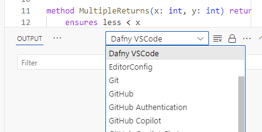

# Learning Dafny

- [Dafny Website](https://dafny.org/)
- [How to intall and runn Dafny](https://dafny.org/latest/Installation)
- [Tutorial: Getting started with Dafny](https://dafny.org/dafny/OnlineTutorial/guide.html)

When using VS Code, you view Dafny's output in the output tab, the selecting **Dafny VSCode** in the drop-down:

